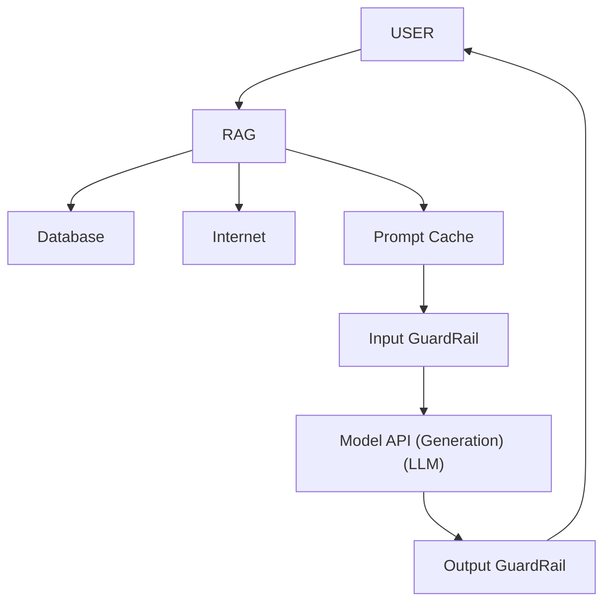

# Gen AI Architecture

```mermaid
graph TD;
    USER --> RAG;
    RAG --> Database;
    RAG --> Internet;
    RAG --> PromptCache;
    PromptCache --> InputGuardRail;
    InputGuardRail --> ModelAPI;
    ModelAPI --> OutputGuardRail;
    OutputGuardRail --> USER;

    PromptCache["Prompt Cache"];
    InputGuardRail["Input GuardRail"];
    ModelAPI["Model API (Generation) (LLM)"];
    OutputGuardRail["Output GuardRail"];

```