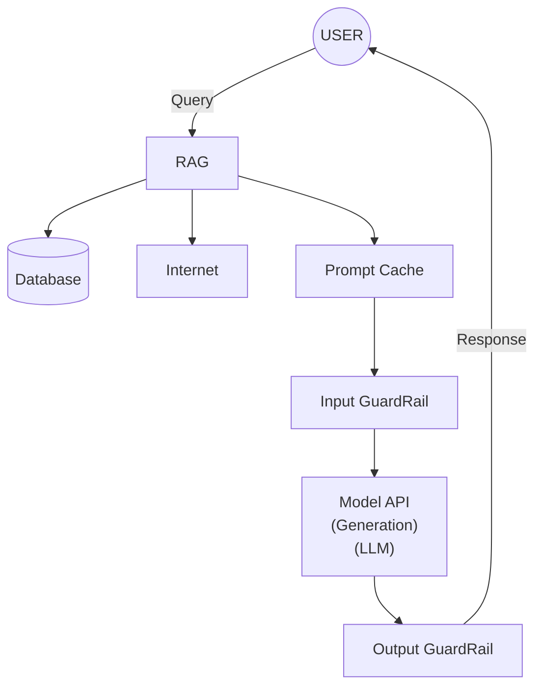

# Gen AI Architecture

RAG = Retreival Augmented Generation

Guardrails are mechanisms and frameworks designed to ensure that AI systems operate within ethical, legal, and technical boundaries. They act as a safety net.

Cache for optimization: there are a lot of places where we can put this depending on the size of the stuff the user sends, or if we want to cache some answers from the model, etc...

